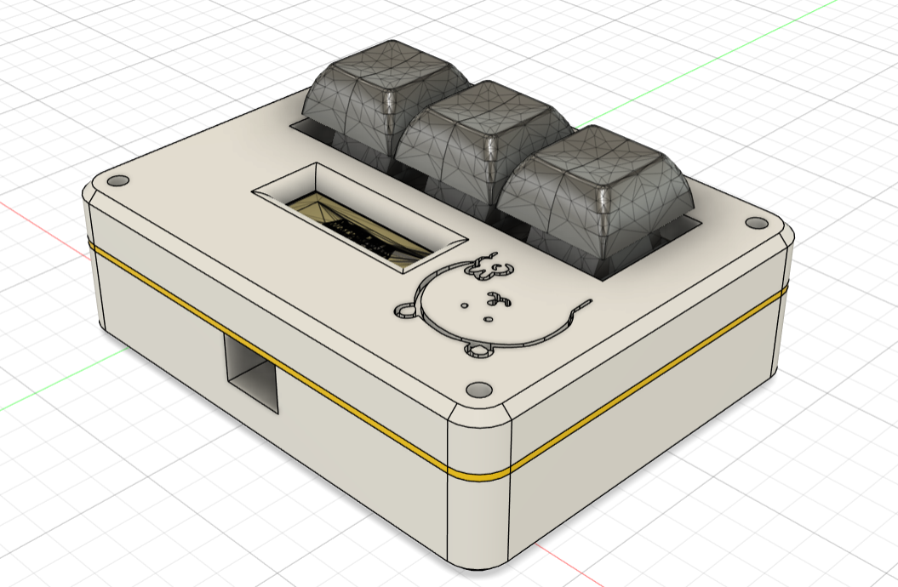
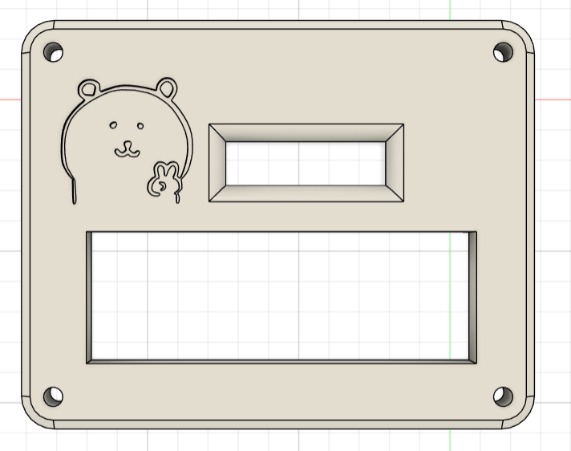
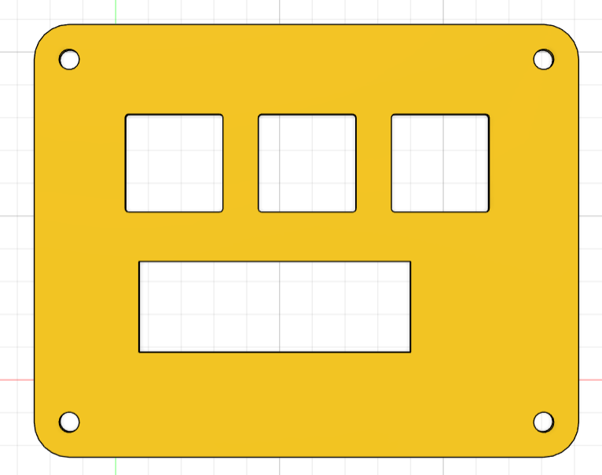
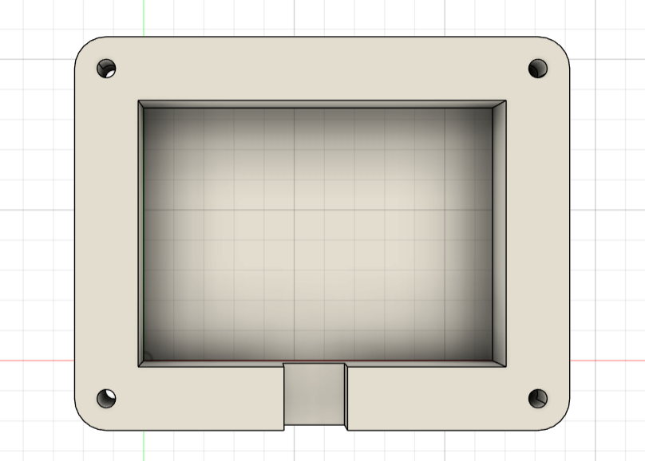
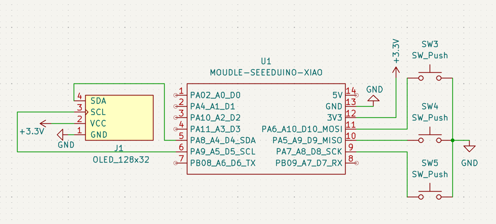
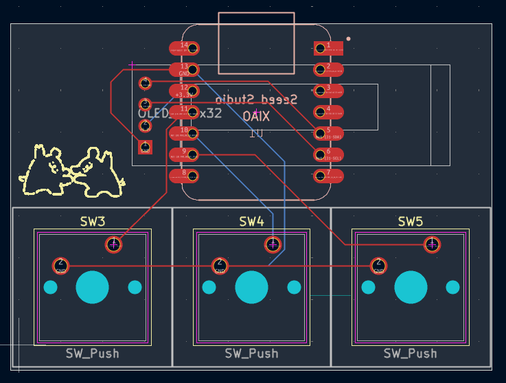

# Padderwadder
Padderwadder is a simple 3-key macropad featuring an OLED Display! I programmed this macropad for the game osu! using KMK Firmware. This is my first ever hardware project, so I got to learn how to use a ton of new programs throughout the process :D

## Features
- 3 keys
- A 0.91 inch OLED Display
- A 3D printed case
- QMK Firmware

## CAD
Heres my CAD model, made in Fusion 360! The case is held together by 4 M3 Bolts and heatset inserts. I think I spent almost half of my time researching and figuring things out but I had fun :)

| Top                            | Middle                              | Middle                               |
| ------------------------------ | ----------------------------------- | ------------------------------------ |
|  |  |  |

## PCB
My PCB, made in KiCad 10.0

**Schematic**:

**PCB**:

## BOM
Everything needed for this design:
- 1 unsoldered Seeed XIAO RP2040
- 3x MX-Style switches
- 1x 0.91 inch 128x32 OLED display
- 4x M3x16mm screws
- 4x M3x5mx4mm heatset inserts
- 3D printed case
